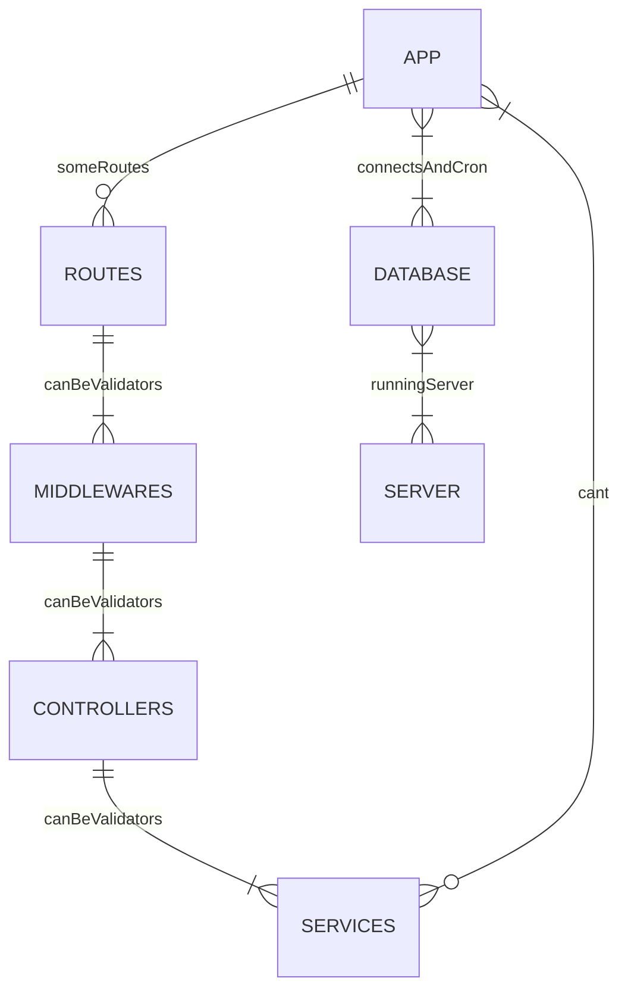

# CRMPS Backend
## _By Samokhval Stefan_

____

Customer relationship management (CRM) is a technology for managing all your company’s relationships and interactions with customers and potential customers. The goal is simple: Improve business relationships to grow your business. A CRM system helps companies stay connected to customers, streamline processes, and improve profitability.

____

## Features

- Pagination
- Auth
- Sorts

____

## Tech

CRMPS uses a number of open source projects to work properly:

- [Intellij Idea](https://www.jetbrains.com/idea/) - awesome code editor
- [node.js](https://nodejs.org/en) - evented I/O for the backend
- [Express](https://expressjs.com/) - fast node.js network app framework
- [Typescript](https://www.typescriptlang.org/) - strongly typed programming language that builds on JavaScript.

Postman [link](https://api.postman.com/collections/20975829-c3bdaf7c-253a-4b09-aaee-d3b03bab9418?access_key=PMAT-01H1XVV5YPE1YPHCDWE51XYYJR)

____

## Installation

CRMPS requires [Node.js](https://nodejs.org/) v19.7+ to run.

Add .env file ( for example you have .env.example file )

```dotenv
PORT=
DB_URL=

ACCESS_SECRET=
REFRESH_SECRET=

FORGOT_SECRET=
ACTIVATE_SECRET=

PASSWORD_SALT=
```

____

**IF YOU WANT TO USE NPM!**
- **Change the package.json scripts to:**

```json
"scripts": {
    "start": "rimraf dist && tsc-watch --onSuccess 'npm run watch'",
    "watch": "nodemon 'src/app.ts' --watch './src'",
    "lint": "eslint \"{src,apps,libs,test}/**/*.ts\" --fix",
    "prepare": "husky install"
  }
```

____

Install the dependencies and devDependencies and start the server via npm.

```sh
cd crmps-backend
npm i
npm run start
```

Or using via yarn

```sh
cd crmps-backend
yarn install
yarn run start
```

____

## Development

Want to contribute? Great!

CRMPS uses nodemon + eslint for fast developing.
Make a change in your file and instantaneously see your updates!

Open your favorite Terminal and run these commands.

First Tab:

```sh
npm run lint
```

Second Tab:

```sh
npm run start
```

Or using via yarn

First Tab:

```sh
yarn run lint
```

Second Tab:

```sh
yarn run start
```

- [X] Backend
    - [X] Pagination
    - [X] Users
    - [X] Comments
    - [X] Group
    - [X] Auth
    - [X] Sort
    - [X] Documentation
    - [X] Swagger

- [ ] Frontend
    - [X] Figma mobile design
    - [ ] Figma PC design
    - [ ] Main Page
    - [ ] Query
    - [ ] Details
    - [ ] Edit
    - [ ] Comments
    - [ ] Documentation

## How it works

